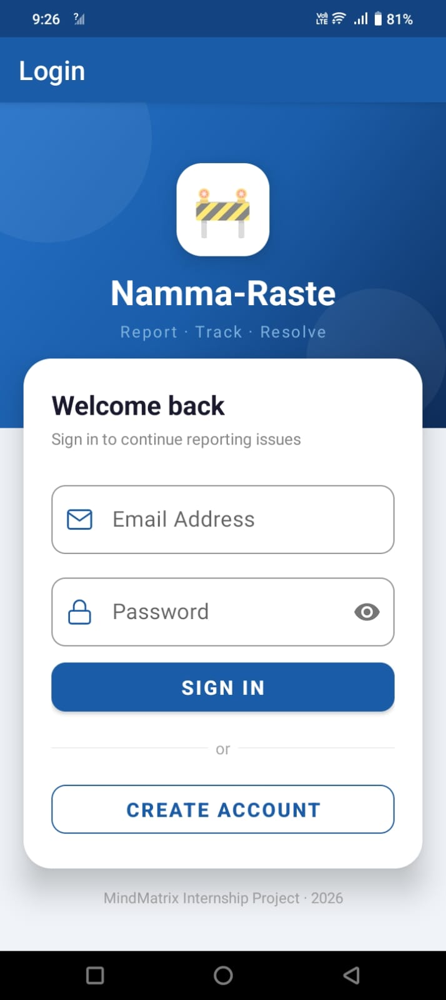

# 🚦 NammaRaste — Civic Road Issue Reporter

> **Report potholes, broken streetlights, and road damage in your city — straight from your phone.**

NammaRaste is an Android application that empowers citizens to report infrastructure issues with photo evidence, GPS location, and a unique ticket ID. Built as part of the **MindMatrix VTU Internship Program**.

---

## 📱 Screenshots

| Login Screen | Home Screen | Report Submission | Report Detail |
|---|---|---|---|
|  |  |  |


---

## ✨ Features

- 🔐 **Firebase Authentication** — Secure email + password login. Credentials managed entirely by Google Firebase — never stored locally.
- 📸 **Photo Capture via CameraX** — Capture issue images directly in-app using Android's CameraX API. Photos stored in app-private internal storage.
- 📍 **Automatic GPS Tagging** — GPS latitude and longitude auto-detected at time of report submission. No manual entry needed.
- 🎫 **Unique Ticket ID Generation** — Every report gets a unique ID (format: `NR-YYYYMMDD-NNNN`) for tracking.
- 🗂️ **Local Report Storage (Room DB)** — All reports saved locally using Room Database (SQLite) for offline access.
- ☁️ **Firebase Firestore Sync** — Reports synced to Firestore cloud for cross-device access and backup.
- ⚡ **Real-time LiveData Updates** — Home screen updates instantly when a new report is submitted — no manual refresh needed.
- 🏗️ **MVVM Architecture** — Clean separation of concerns: Fragment → ViewModel → Repository → Room DAO.
- 👤 **User Profile** — personalized profile section to manage user information and track submitted reports
- 📤 **Share Report** — easily share reported issues and updates with others through generated links or social platforms
 

---

## 🛠️ Tech Stack

| Layer | Technology |
|---|---|
| Language | Kotlin + Java |
| Architecture | MVVM + Repository Pattern |
| UI | Fragments + XML Layouts |
| Local Database | Room Database (SQLite) |
| Authentication | Firebase Authentication |
| Cloud Sync | Firebase Firestore |
| Camera | CameraX |
| Image Loading | Glide |
| Location | FusedLocationProviderClient (GPS) |
| Async | Kotlin Coroutines |
| Build System | Gradle (Kotlin DSL) |

---

## 📂 Folder Structure

```
Namma-Raste/
├── app/
│   ├── src/
│   │   └── main/
│   │       ├── java/com/namma/raste/
│   │       │   ├── data/
│   │       │   │   ├── model/
│   │       │   │   │   └── Report.kt             # Room Entity — all 11 report fields
│   │       │   │   ├── local/
│   │       │   │   │   ├── ReportDao.kt           # Room DAO — insert, query, update
│   │       │   │   │   └── NammaRasteDatabase.kt  # Room Database instance
│   │       │   │   ├── repository/
│   │       │   │   │   ├── ReportRepository.kt            # Local Room operations
│   │       │   │   │   └── FirestoreReportRepository.kt   # Firestore cloud sync
│   │       │   │   └── sync/
│   │       │   │       └── ReportSyncManager.kt   # Offline-first sync bridge
│   │       │   ├── ui/
│   │       │   │   ├── HomeFragment.kt            # Report list with LiveData observer
│   │       │   │   ├── ReportFragment.kt          # Report submission + CameraX + GPS
│   │       │   │   ├── DetailFragment.kt          # Full report detail view
│   │       │   │   └── LoginActivity.kt           # Firebase Auth login/register
│   │       │   └── viewmodel/
│   │       │       ├── ReportViewModel.kt         # Business logic + LiveData
│   │       │       └── AuthViewModel.kt           # Firebase Auth state
│   │       ├── res/
│   │       │   ├── layout/                        # XML screen layouts
│   │       │   ├── drawable/                      # Icons and vector assets
│   │       │   └── values/                        # Colors, strings, themes
│   │       └── AndroidManifest.xml
│   └── build.gradle.kts                           # App-level dependencies
├── gradle/wrapper/
├── build.gradle.kts                               # Project-level build config
├── settings.gradle.kts
└── README.md
```

---

## ⚙️ Setup Instructions

### Prerequisites

- Android Studio **Hedgehog (2023.1.1)** or later
- Android SDK — minimum API Level **28 (Android 9.0)**
- A Firebase project with **Authentication** and **Firestore** enabled
- A physical or emulator device with **camera and GPS** support

### Step 1 — Clone the repository

```bash
git clone https://github.com/Darshan-DG2k4/Namma-Raste.git
cd Namma-Raste
```

### Step 2 — Set up Firebase

1. Go to [Firebase Console](https://console.firebase.google.com) and create a new project (or use an existing one).
2. Add an **Android app** with package name `com.namma.raste`.
3. Enable **Authentication** → Sign-in method → **Email/Password**.
4. Enable **Firestore Database** → Start in **test mode** → Region: `asia-south1`.
5. Download `google-services.json` from Project Settings → Your Apps.
6. Place `google-services.json` inside the `app/` directory:

```
Namma-Raste/
└── app/
    └── google-services.json   ← place it here
```

> ⚠️ `google-services.json` is excluded from this repository for security. You must generate your own from the Firebase Console.

### Step 3 — Open in Android Studio

1. Open **Android Studio**.
2. Select **File → Open** and navigate to the cloned `Namma-Raste/` folder.
3. Wait for Gradle sync to complete (this may take a few minutes on first run).

### Step 4 — Run the app

1. Connect an Android device via USB (with USB debugging enabled), or start an emulator.
2. Click the **▶ Run** button in Android Studio, or run:

```bash
./gradlew assembleDebug
```

3. The app will install and launch on the connected device.

### Step 5 — Add Firestore Security Rules (optional but recommended)

In the [Firebase Console](https://console.firebase.google.com) → Firestore → Rules, paste:

```
rules_version = '2';
service cloud.firestore {
  match /databases/{database}/documents {
    match /reports/{ticketId} {
      allow read, write: if request.auth != null
                         && request.auth.uid == resource.data.userId;
      allow create: if request.auth != null
                    && request.auth.uid == request.resource.data.userId;
    }
  }
}
```

---

## 📊 Database Schema

| Field | Type | Description |
|---|---|---|
| `ticketId` | String (PK) | Unique ID — format `NR-YYYYMMDD-NNNN` |
| `userId` | String | Firebase Auth UID of reporter |
| `photoPath` | String | Local path to captured photo (app-private storage) |
| `issueType` | String | `POTHOLE` / `STREETLIGHT` / `OTHER` |
| `severity` | String | `LOW` / `MEDIUM` / `HIGH` |
| `latitude` | Double | GPS latitude of issue location |
| `longitude` | Double | GPS longitude of issue location |
| `timestamp` | Long | Unix timestamp of submission |
| `status` | String | `SUBMITTED` / `IN_PROGRESS` / `RESOLVED` |
| `aiConfidence` | Int | Reserved for future AI confidence score (default: 0) |
| `description` | String | Optional user description (max 200 chars) |

---

## 🔄 Report Status Lifecycle

```
SUBMITTED  ──▶  IN_PROGRESS  ──▶  RESOLVED
   │                                  │
   └── Default on submit              └── Issue fixed by authority
```

---

## 🏗️ Architecture Overview

```
UI Layer (Fragments / XML)
        │
        ▼  observes LiveData
ViewModel Layer (ReportViewModel, AuthViewModel)
        │
        ▼  calls
Repository Layer (ReportRepository, FirestoreReportRepository)
        │                    │
        ▼                    ▼
Room Database          Firebase Firestore
(Local / Offline)     (Cloud / Sync)
```

The app follows an **offline-first** approach:
1. Every report is saved to Room DB first (works without internet).
2. Firestore sync is attempted immediately after.
3. If offline, pending reports are synced when connectivity is restored.

---

## 🔐 Permissions Required

| Permission | Reason |
|---|---|
| `CAMERA` | Capture issue photos using CameraX |
| `ACCESS_FINE_LOCATION` | GPS coordinates for issue location |
| `ACCESS_COARSE_LOCATION` | Fallback location when GPS is unavailable |
| `INTERNET` | Firebase Auth and Firestore sync |

---

## 🚀 Future Improvements

- 🗺️ Map view — visualise all reported issues on an interactive map
- 🔔 Push notifications — alert citizens when report status changes
- 🤖 AI issue detection — auto-classify issue type from photo using ML Kit
- 📊 Analytics screen — charts showing issue types and resolution rates by area

---

---

## 📄 License

This project was developed for educational purposes as part of the MindMatrix VTU Internship Program.

---

<div align="center">
  <sub>Made with ❤️ in Bengaluru · NammaRaste — Namma City, Namma Responsibility</sub>
</div>
